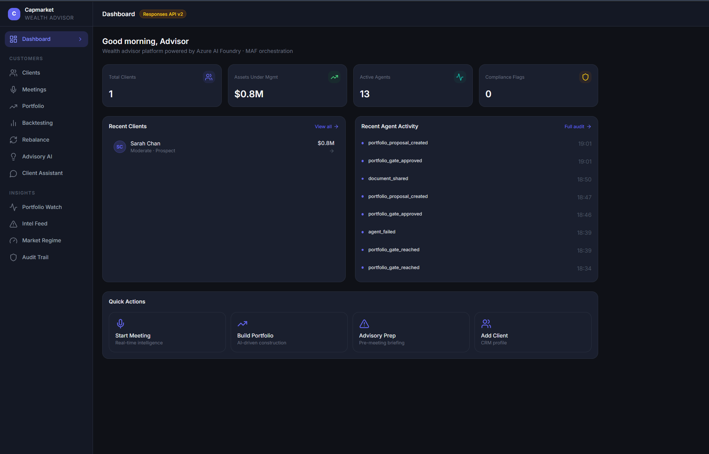
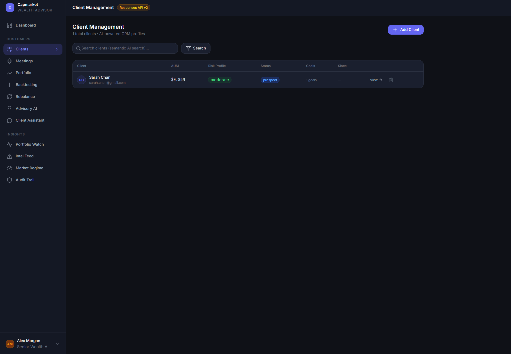
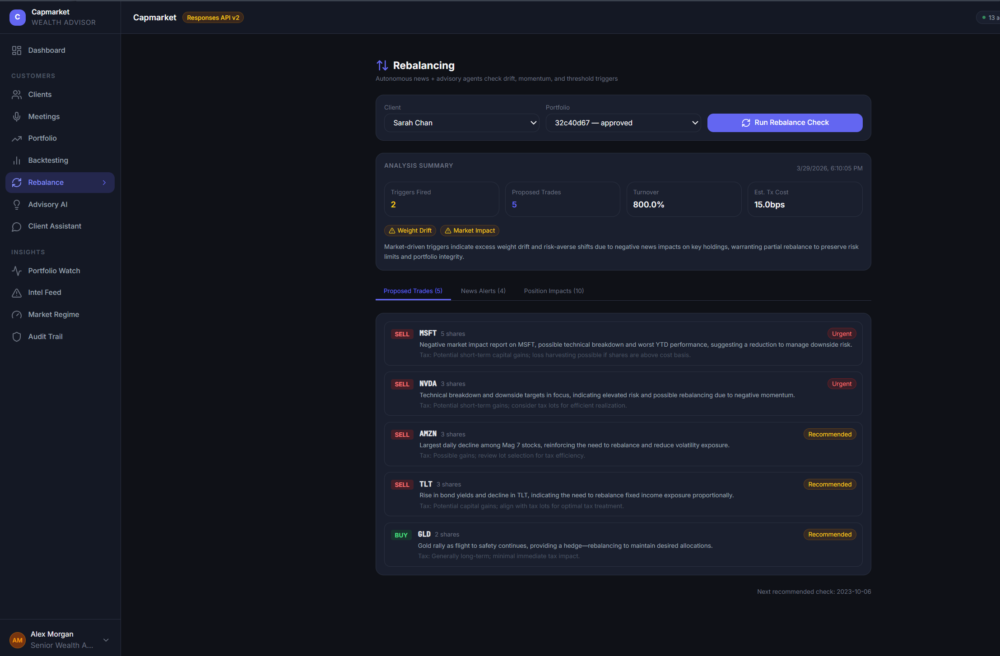
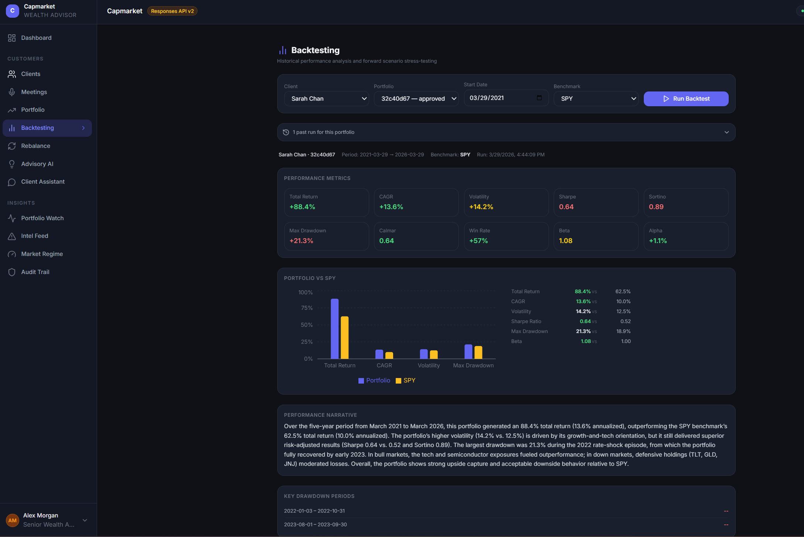

# Capmarket — AI Wealth Advisor Platform

End-to-end wealth advisor platform built on **Azure AI Foundry Responses API v2** with **Microsoft Agent Framework (MAF)** orchestration. 15 specialized AI agents collaborate across meeting intelligence, portfolio construction, market surveillance, and client advisory — all with mandatory human-in-the-loop gates and an immutable CosmosDB audit trail.

## Screenshots

| Dashboard | AI Portfolio Construction |
|-----------|--------------------------|
|  |  |

| Client Management | Client Profile |
|-------------------|----------------|
|  |  |

| Client Meeting History | Rebalancing |
|------------------------|-------------|
|  |  |

| Pre-Meeting Briefing | Position Briefing |
|----------------------|-------------------|
|  |  |

| Tax Strategies | Relationship Ideas |
|----------------|--------------------|
|  |  |

| Advisor AI Chat | Portfolio Watch |
|-----------------|------------------|
|  |  |

| Portfolio Positions | Intel Feed |
|---------------------|------------|
|  |  |

| Market Regime | Backtesting |
|---------------|-------------|
|  |  |

| Audit Trail | |
|-------------|---|
|  | |

## Architecture

```
+-----------------------------------------------------------------------+
|  React Frontend (Vite + TypeScript + Tailwind)  :5173                 |
|  Dashboard - Meetings - Clients - Portfolio - Backtesting - Rebalance |
|  Advisory AI - Client Assistant                                        |
|  INSIGHTS: Portfolio Watch - Intel Feed - Market Regime - Audit Trail  |
+-------------------------------+---------------------------------------+
                                | /api/*
+-------------------------------v---------------------------------------+
|  FastAPI Backend  :8000                                               |
|  7 routers - pydantic-settings - uvicorn                              |
+----+----------------+----------------+----------------+---------------+
     |  MAF workflows |  15 AI agents  |  Cosmos store  |  AI Search
     v                v                v                v
Azure AI Foundry  Responses API  CosmosDB async   AI Search
(Responses v2)   (gpt-4o/mini)  capmarket DB      3 indexes
```

## Modules

| Module | Agents | Workflow | Key Capability |
|--------|--------|----------|----------------|
| **Meeting Intelligence** | Transcription, Sentiment, PII, Profile, Recommendation, Summary | `MeetingWorkflow` | Real-time transcript to compliance-checked recs with HITL approval gates |
| **Client Intelligence** | Profile | CRUD + merge | Rich CRM profiles: risk tolerance, tax bracket, goals, concerns, estate planning; full meeting history with advisor summary, client summary, key decisions, compliance notes, recommendations, and action items |
| **Portfolio Construction** | Portfolio, News, Backtesting, Rebalance | `PortfolioWorkflow` | 6-stage DAG (Sense, Think, Act) with HITL gates; theme allocations, position table with signals, conviction and rationale |
| **Rebalancing** | Rebalance, News | On-demand | Autonomous news + advisory agents check drift, momentum and threshold triggers; proposed trades with urgency, tax impact notes, estimated turnover and transaction cost |
| **Portfolio Watch** | MarketRegime, RiskAdvisory, News, Rebalance | Autonomous 30-min cycle | Continuous portfolio surveillance; Intel Feed alerts, regime classification, rebalance proximity signals, position intelligence table |
| **Backtesting** | Backtesting | On-demand | Historical performance vs benchmark (SPY); total return, CAGR, Sharpe, Sortino, max drawdown, alpha, win rate; AI performance narrative |
| **Advisory Intelligence** | Advisory, Tax, News | `AdvisoryWorkflow` | 5 tabs: Pre-Meeting Briefing (client-contextualized market overview, critical alerts, portfolio-level impacts, advisor talking points, tax opportunities), Position Briefing (at-risk positions with urgency tags and opportunities), Tax Strategies (ranked TLH opportunities with implementation steps and deadlines), Advisor AI Chat (Bing-grounded Q&A with supporting evidence, action items and caveats), Relationship Ideas (categorized engagement actions with effort and timing) |
| **Client Assistant** | Communication | `ClientServiceWorkflow` | 24/7 compliant virtual team member, escalation detection |
| **Audit & Compliance** | All agents emit audit events | CosmosDB `audit_log` | Immutable per-agent I/O trail; human gate decisions logged with timestamp, session and client context |

## Agents

| Agent | Model | Bing Grounded | Role |
|-------|-------|---------------|------|
| `TranscriptionAgent` | gpt-4o | No | Meeting audio to structured transcript |
| `SentimentAgent` | gpt-4o-mini | No | Real-time client sentiment scoring |
| `PIIAgent` | gpt-4o-mini | No | PII detection and redaction |
| `ProfileAgent` | gpt-4o | No | Client profile extraction and enrichment |
| `RecommendationAgent` | gpt-4o | No | Compliance-checked investment recommendations |
| `SummaryAgent` | gpt-4o | No | Meeting summary and action items |
| `NewsAgent` | gpt-4o-mini | Yes | Bing-grounded market news and thematic signals |
| `PortfolioConstructionAgent` | gpt-4o | No | Universe mapping, fundamentals, portfolio build |
| `BacktestingAgent` | gpt-4o-mini | No | Historical performance simulation vs benchmark |
| `RebalanceAgent` | gpt-4o-mini | No | Drift, vol-cap, correlation rebalance signals |
| `MarketRegimeAgent` | gpt-4o-mini | Yes | VIX term structure, ATR regime, selloff risk scoring |
| `RiskAdvisoryAgent` | gpt-4o-mini | No | Rolling synthesis of news + regime into portfolio risk advisories |
| `AdvisoryAgent` | gpt-4o | Yes | Pre-meeting briefing, advisor AI chat |
| `TaxAgent` | gpt-4o-mini | Yes | Tax-loss harvesting, bracket analysis |
| `CommunicationAgent` | gpt-4o | Yes | Client 24/7 assistant, escalation detection |

## Tech Stack

| Layer | Technology |
|-------|-----------|
| Backend runtime | Python 3.11, FastAPI, uvicorn |
| Agent runtime | Azure AI Foundry Agents v2 (`azure-ai-projects>=2.0.0b4`) |
| LLM API | **Responses API** (`openai.responses.create` with `agent_reference`) |
| Orchestration | **Microsoft Agent Framework (MAF)** — `pip install agent-framework --pre` |
| Vector / RAG | Azure AI Search (`azure-search-documents`) — hybrid semantic |
| Session store | Azure CosmosDB async client — 7 containers |
| Auth | `ClientSecretCredential` (Entra ID) |
| Grounding | Azure Bing Search (advisory, news, tax, market regime, communication agents) |
| Speech | Azure Cognitive Services Speech SDK |
| Frontend | React 18 + Vite + TypeScript + Tailwind CSS |

## Human-in-the-Loop Gates

All workflows pause at named gates for mandatory human approval before proceeding:

- **Meeting**: Gate 1 (recommendations review), Gate 2 (summary approval)
- **Portfolio**: Gate 1 (theme activation), Gate 2 (portfolio approval), Gate 3 (trade execution)
- WebSocket pushes live updates to the UI during active meetings
- Every gate decision is logged to the immutable `audit_log` CosmosDB container

## Quick Start

### 1. Configure credentials

```bash
cp backend\.env.example .env
# Edit .env with your Azure credentials
```

Key variables:
```
FOUNDRY_PROJECT_ENDPOINT=https://<workspace>.services.ai.azure.com/api/projects/<project>
AZURE_TENANT_ID, AZURE_CLIENT_ID, AZURE_CLIENT_SECRET
COSMOS_DB_ENDPOINT, COSMOS_DB_DATABASE=capmarket
AZURE_SEARCH_ENDPOINT, AZURE_SPEECH_KEY
BING_SEARCH_KEY
```

### 2. Backend setup

```bat
setup_backend.bat
```

This creates `backend\.venv`, installs all Python dependencies, and installs MAF.

### 3. Start services

```bat
run_all.bat
```

Or individually:
```bat
run_backend.bat   # FastAPI on :8000
run_frontend.bat  # React on :5173
```

Open http://localhost:5173

## Project Structure

```
capmarket/
+-- backend/
|   +-- config.py                        # Central pydantic-settings config (15 agent models)
|   +-- requirements.txt
|   +-- .env.example
|   +-- app/
|       +-- main.py                      # FastAPI entry point + lifespan
|       +-- infra/                       # settings re-export, telemetry
|       +-- models/                      # Pydantic v2 domain models
|       |   +-- meeting.py
|       |   +-- client.py
|       |   +-- portfolio.py
|       |   +-- audit.py
|       +-- persistence/
|       |   +-- cosmos_store.py          # Async CosmosDB (7 containers)
|       |   +-- search_store.py          # Azure AI Search RAG
|       +-- agents/                      # 15 Foundry v2 agents
|       |   +-- base_agent.py            # FoundryAgentBase (Responses API)
|       |   +-- transcription_agent.py
|       |   +-- sentiment_agent.py
|       |   +-- profile_agent.py
|       |   +-- recommendation_agent.py
|       |   +-- summary_agent.py
|       |   +-- pii_agent.py
|       |   +-- advisory_agent.py
|       |   +-- tax_agent.py
|       |   +-- communication_agent.py
|       |   +-- portfolio_agent.py
|       |   +-- news_agent.py
|       |   +-- backtesting_agent.py
|       |   +-- rebalance_agent.py
|       |   +-- market_regime_agent.py   # VIX/ATR regime + selloff risk
|       |   +-- risk_advisory_agent.py   # Rolling news+regime risk synthesis
|       +-- orchestration/               # MAF workflows
|       |   +-- meeting_workflow.py
|       |   +-- portfolio_workflow.py
|       |   +-- advisory_workflow.py
|       |   +-- client_service_workflow.py
|       +-- routers/                     # FastAPI routers
|           +-- health.py
|           +-- meetings.py
|           +-- clients.py
|           +-- portfolio.py
|           +-- advisory.py
|           +-- client_assistant.py
|           +-- audit.py
+-- frontend/
|   +-- package.json                     # React 18 + Vite + Tailwind
|   +-- src/
|       +-- App.tsx                      # Routes
|       +-- main.tsx
|       +-- index.css                    # Tailwind + component classes
|       +-- api/index.ts                 # Typed axios API client
|       +-- types/index.ts               # Domain type definitions
|       +-- components/
|       |   +-- layout/                  # Sidebar, TopBar, Layout
|       |   +-- meeting/                 # TranscriptPanel, SentimentGauge, RecommendationFeed
|       |   +-- portfolio/               # AllocationChart, PositionTable, WorkflowProgress
|       +-- pages/
|           +-- DashboardPage.tsx        # KPIs, recent agent activity, quick actions
|           +-- MeetingPage.tsx          # Real-time meeting with transcript + HITL gates
|           +-- ClientsPage.tsx          # Semantic AI search CRM list
|           +-- ClientProfilePage.tsx    # Full client profile with meeting history + portfolio
|           +-- PortfolioPage.tsx        # 6-stage AI portfolio construction workflow
|           +-- BacktestPage.tsx         # Historical performance analysis vs benchmark
|           +-- RebalancePage.tsx        # Drift + vol-cap rebalance recommendations
|           +-- AdvisoryPage.tsx         # Bing-grounded advisory prep + AI chat
|           +-- ClientAssistantPage.tsx  # 24/7 client assistant chat
|           +-- PortfolioWatchPage.tsx   # Autonomous surveillance + Intel Feed + position table
|           +-- IntelFeedPage.tsx        # News alerts ranked by severity (Critical/High/Medium)
|           +-- MarketRegimePage.tsx     # VIX term structure, ATR regime, scan history
|           +-- AuditPage.tsx            # Immutable event log with filters
+-- setup_backend.bat
+-- run_backend.bat
+-- run_frontend.bat
+-- run_all.bat
```

## CosmosDB Containers

| Container | Partition Key | Purpose |
|-----------|--------------|---------|
| `sessions` | `/client_id` | Meeting sessions + state |
| `clients` | `/advisor_id` | Client CRM profiles |
| `portfolios` | `/client_id` | Portfolio proposals |
| `audit_log` | `/client_id` | Every agent I/O event |
| `checkpoints` | `/workflow_id` | Human-in-the-loop gate state |
| `advisory_sessions` | `/advisor_id` | Advisory prep results |
| `client_conversations` | `/client_id` | 24/7 assistant history |

## API Endpoints

| Method | Path | Description |
|--------|------|-------------|
| `GET` | `/api/health` | Service health + CosmosDB status |
| `POST` | `/api/meetings/start` | Start meeting session |
| `POST` | `/api/meetings/pre-briefing` | AI pre-meeting briefing |
| `WS` | `/api/meetings/ws` | Real-time meeting events |
| `POST` | `/api/meetings/{id}/recommend` | Generate recommendations |
| `POST` | `/api/meetings/{id}/approve-recommendations` | HITL gate 1 |
| `POST` | `/api/meetings/{id}/finalize` | Generate summaries |
| `GET` | `/api/clients` | List / semantic search |
| `POST` | `/api/portfolio/run` | Start portfolio workflow |
| `POST` | `/api/portfolio/runs/{id}/gate` | Approve/reject gate |
| `POST` | `/api/portfolio/watch` | Run autonomous portfolio watch cycle |
| `GET` | `/api/portfolio/intel-feed` | Latest news alerts for a portfolio |
| `GET` | `/api/portfolio/market-regime` | Current VIX/ATR regime snapshot |
| `POST` | `/api/portfolio/backtest` | Run historical backtest vs benchmark |
| `POST` | `/api/advisory/pre-meeting` | Pre-meeting briefing |
| `POST` | `/api/advisory/chat` | Advisor AI chat |
| `POST` | `/api/assistant/query` | Client 24/7 query |
| `GET` | `/api/audit` | Query audit log with filters |
| `GET` | `/api/audit/log` | Paginated audit trail |

Full Swagger: http://localhost:8000/docs
